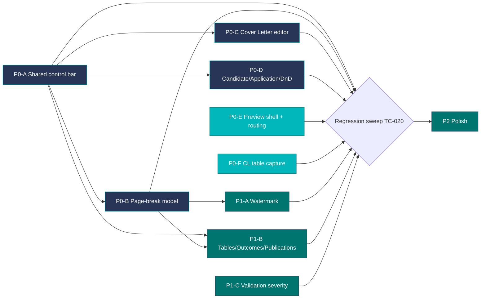
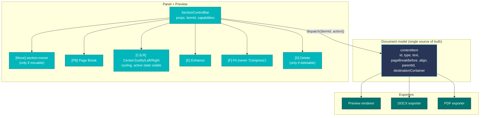
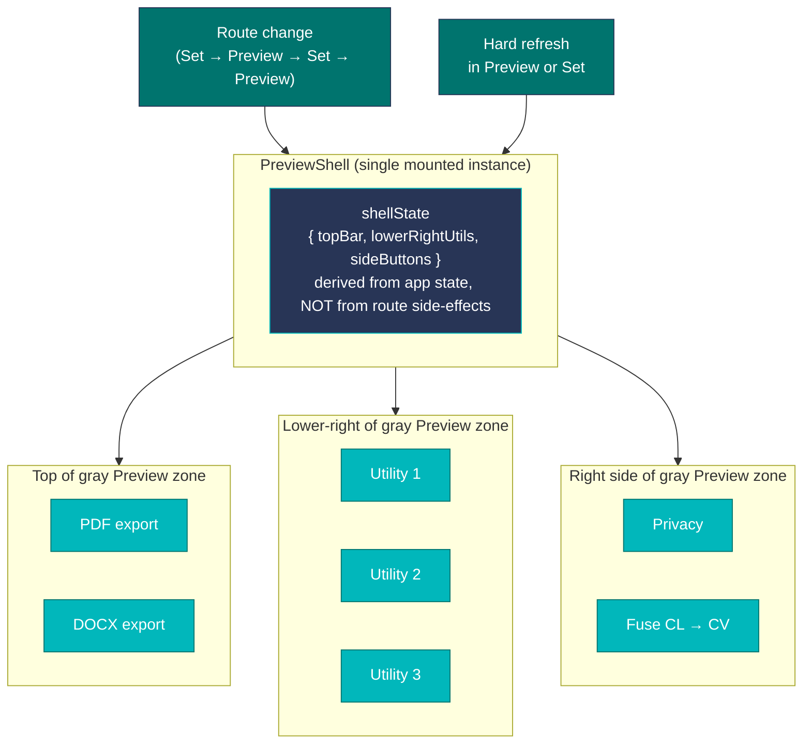
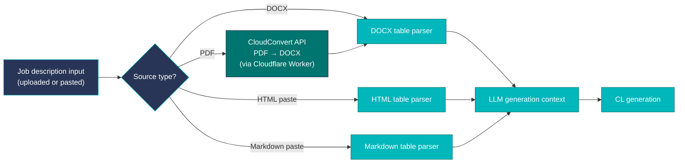

# AntCV — UI/UX Bug-fix Implementation and QA Plan

| | |
|---|---|
| Source spec | `AntCV_UI_UX_Spec_and_QA_Plan_v2.docx` (v2 supersedes v1) |
| Plan version | v2.1 — adds resolved decisions for PRV-004, CL-006, AH-001 |
| Scope | Cover Letter editor, page-break model, AI watermark, Candidate/Application, drag-and-drop, tables, Selected Outcomes, Publications, Preview shell routing/visibility, LLM input pipeline |
| Output rule | Every change must behave identically in Preview, DOCX, and PDF unless the requirement explicitly excludes export |
| Authority | This plan paraphrases the source spec for execution. On any conflict, the source spec wins. |
| Acceptance gate | A requirement is done only when the Definition of Done block (§9) is filled in and all linked test cases pass in Preview **and** DOCX **and** PDF |

The v2 spec contains **44 numbered requirements** plus **18 visual findings**. They cluster into **nine implementation areas**. Most of the section-level fixes are downstream of one shared refactor (the `SectionControlBar`), so doing that first turns the per-section fixes into configuration changes. The Preview-shell, Application History, validation-severity, and CL-table-capture fixes are independent of that refactor and can run in parallel — see §1.

---

## 0. Resolved decisions (locked) — read before implementing

These three decisions were previously open questions. They are now locked. Any implementation must match them.

| Decision | Resolution | Affects |
|---|---|---|
| **PRV-004 — loading status click behaviour** | **No-op while a job is active.** Clicks during loading neither hide the status nor open a details view. After completion, normal dismiss is allowed. | `pwa/antcv-stale-status.js`, `pwa/antcv-wait-screen-times.js`. Don't build a details view. |
| **CL-006 — PDF table parsing** | **Use CloudConvert for proper conversion: PDF → DOCX server-side via the existing Cloudflare Worker chain, then parse DOCX tables with the same parser used for DOCX-source JDs.** Do not attempt to extract tables from raw PDF text. Proper structure preservation is required, not best-effort flattening. | `pwa/antcv-data-importer.js`, `pwa/antcv-jd-image-ocr.js`, the Cloudflare Worker(s), and the DOCX table parser. Requires a CloudConvert API key in Worker secrets. |
| **AH-001 — browser back from Application History** | **Browser back returns to Preview** (where the popup was opened from). | `pwa/antcv-app-history-zfix-291.js`. The route push for "Open in Settings" must build a history entry that resolves to Preview on `popstate`. |

---

## 1. Priority and sequencing

Implement in this order. Each phase is a coherent commit/PR boundary. Phases marked **(parallel)** do not depend on P0-A and can run alongside it.

| Phase | IDs | Why this phase |
|---|---|---|
| **P0-A — Shared control component** | GEN-001..GEN-008 | All section-level fixes ride on this. Without it, the same defect is patched 7+ times in 7+ files. |
| **P0-B — Page-break model** | PB-001..PB-006 | Page breaks must live in the document model, not DOM state, because exporters consume the model. PB-006 (Professional Experience) is the positive reference UX — match it. |
| **P0-C — Cover Letter editor** | CL-001..CL-005, VF-001..VF-003 | Highest-visibility defect set (duplicate overlay on every text selection). |
| **P0-D — Candidate, Application, drag-and-drop** | CA-001..CA-005, VF-005..VF-007 | Drag-and-drop corrupts placement and styling; blocks any further layout work. |
| **P0-E — Preview shell + routing (parallel)** | PRV-001..PRV-004, AH-001, GEN-009, GEN-010, VF-011..VF-015 | Desktop users intermittently cannot see export buttons. Independent of P0-A. Should ship as soon as possible. |
| **P0-F — CL table capture (parallel)** | CL-006, GEN-011, VF-017 | Silent data loss in Cover Letter generation. Requires CloudConvert integration server-side. Independent of UI refactor. |
| **P1-A — AI watermark anchoring** | WM-001..WM-002, VF-004 | Final-output quality. Must be page-box-anchored, not flow-anchored. |
| **P1-B — Tables, Selected Outcomes, Publications** | TB-001..TB-003, SO-001..SO-002, PP-001..PP-003, VF-008..VF-010 | Extends the shared control model to row-based sections. PP-003 is a stability risk warning — test thoroughly. |
| **P1-C — Validation severity** | VAL-001, VF-016 | Warnings yellow, errors red. Small but visible. |
| **P2** | Accessibility labels, keyboard focus order, fixture set | Polish after behavior is stable. |

### Dependency diagram



---

## 2. Architectural diagram — shared control model



Two contracts derive from this:

1. **Action contract.** Every control event carries `{ itemId, action, payload? }`. Actions without `itemId` are rejected and logged. This is what enforces GEN-002 (control locality) — there is no path by which "click Page Break on row 3" can update row 4.
2. **Capabilities contract.** Each section declares what its items support: `{ canMove, canDelete, canPageBreak, canAlign, canEnhance, canFit }`. The `SectionControlBar` reads this and renders only the relevant buttons in the standard order (GEN-003).

### Preview shell state contract (v2 — for PRV-* and AH-001)



The rule: the Preview shell mounts its visible controls from one derived state. No control's visibility may depend on which route was hard-refreshed last. Today, hard-refresh in Preview restores PDF/DOCX while hard-refresh in Set hides them — that's a side-effect leak that this contract removes.

### CL-006 — CloudConvert pipeline (v2.1 — locked architecture)



The DOCX table parser is the single canonical path. PDFs are normalised into DOCX upstream via CloudConvert, so the LLM context-prep code has one table-parsing implementation, not four.

---

## 3. Repo file map — where each fix lands

The PWA is the single `pwa/app.js` (804 KB) plus a stack of patch overlays. Most defects live in the overlays. Touch the overlay, not `app.js`, unless the underlying model needs to change.

### Existing-issue mapping (v1)

| Area | Primary file(s) to edit | Notes |
|---|---|---|
| Duplicate Preview action overlay (CL-001, VF-001) | `pwa/antcv-overlay.js` (66 KB) | Likely emits the "second" 8-button group on text selection. Hunt for the selection listener and remove the Preview-side overlay; panel-side controls remain authoritative. |
| Shared control bar component | New: `pwa/antcv-section-control-bar.js` | Centralises PB + CJLR + Enhance + Fit + Delete + Move into one component with a capabilities prop. |
| How I Would Contribute bullets (CL-003, VF-002) | `pwa/antcv-how-contribute-controls-245.js`, `pwa/antcv-bullet-targets.js` | Currently has one shared 8-button row instead of per-bullet rows. |
| Foundation textbox split (CL-004, VF-003) | Search `app.js` for `Foundation` renderer; add overlay if needed | One 4-button bar per textbox. |
| Cover letter body section move (CL-005, CA-003, VF-006) | `pwa/antcv-section-panel-211.js`, `pwa/antcv-section-main-panel-fix.js` | Move button exists on Candidate items but is missing on body rows. |
| Page-break model (PB-001..PB-005) | `pwa/antcv-page-breaks-everywhere-284.js`, `pwa/antcv-sidebar-subsection-pagebreaks-329.js`, `pwa/antcv-item-pages-render.js`, `pwa/antcv-page-button-polish-327.js`, `pwa/antcv-table-page-splits-327.js` | PB state must be persisted in the document model and read by Preview, DOCX, and PDF. |
| **PE positive reference (PB-006)** | **`pwa/antcv-exp-continuation-fix.js` (11.8 KB)** | **The "EXPERIENCE (CONT.)" pattern is already working here. Read this overlay first and reuse the same panel-marker + Preview-boundary + continuation-heading pattern for all other sub-subsection page breaks.** |
| Table page-break + CJLR (TB-001..TB-003, VF-008) | `pwa/antcv-core-competencies-row-controls-234.js`, `pwa/antcv-what-i-bring-row-controls-327.js`, `pwa/antcv-table-page-splits-327.js`, `pwa/antcv-table-row-page-controls-328.js` | Per-line CJLR + per-row Page Break. |
| Selected Outcomes (SO-001, SO-002, VF-009) | `pwa/antcv-selected-outcomes-row-controls-237.js` | Add PB / CJLR / Enhance / Fit before the existing Delete. |
| Publications row layout (PP-001..PP-003, VF-010) | `pwa/antcv-publications-strict-row-layout-273.js`, `pwa/antcv-publications-section-panel-row-fix-278.js` | All controls visible at narrow widths. **PP-003: this section is regression-prone — only refactor through the shared row-control model. No ad-hoc absolute positioning.** |
| AI watermark (WM-001, WM-002, VF-004) | `pwa/antcv-overlay.js` (Preview), `pwa/antcv-docx-client.js` (DOCX), `pwa/antcv-pdf-page-mismatch.js` + PDF render path | Anchor to page box, not text flow. Last page only. |
| Candidate/Application sentence (CA-001, CA-002, VF-005) | `pwa/antcv-personality.js` (Candidate render), `pwa/antcv-i18n.js` ("Application:" label) | Panel and Preview sentence stay synchronised. |
| Drag-and-drop placement (CA-004, CA-005, VF-007) | `pwa/antcv-table-fast-drag.js`, `pwa/antcv-section-bar-freeze-fix.js`, `pwa/antcv-splitter-flip.js` | Insertion-point semantics. Re-render moved item with destination style tokens. |
| Banned-wording sweep (GEN-004, PB-005) | `pwa/antcv-banned-audit.js`, `pwa/antcv-i18n.js` | Add "Compress"/"compress" to the banned-string list. Update DA + EN keys. |
| Continuation heading 18 pt offset (PB-003) | `pwa/antcv-docx-client.js` (DOCX), PDF exporter, Preview CSS | 18 pt is from the top of the page, not from the previous block. |

### Second-pass mapping (v2)

| Area | Primary file(s) to edit | Notes |
|---|---|---|
| **Desktop Preview shell — utilities, Privacy, Fuse, PDF/DOCX (PRV-001..PRV-003, VF-011..VF-013)** | `pwa/app.js` (Preview shell component), `pwa/antcv-mobile-controls.css` (33 KB), `pwa/antcv-editor-layout-cleanup-331.js`, `pwa/antcv-settings-front-327.js` | The bug is route-dependent visibility. Hunt for `useEffect` hooks that mount these buttons only on certain route transitions. The fix is one Preview-shell state, derived from app state — not from route side-effects. Mobile must keep parity. |
| **Loading status — no-op while loading (PRV-004, VF-015) — LOCKED** | `pwa/antcv-stale-status.js`, `pwa/antcv-wait-screen-times.js`, possibly `pwa/antcv-pdf-error-toast.js` | **Click during an active job: do nothing.** Do not hide; do not open details. After job completes, normal dismiss is allowed. Don't build a details view — that decision is closed. |
| **Application History foregrounding (AH-001, VF-014) — back returns to Preview** | **`pwa/antcv-app-history-zfix-291.js` (9.2 KB)** | **The "zfix" suffix suggests an earlier attempt that didn't fully solve it.** The action must: (1) close the popup, (2) push a route to Set with Application History as the foreground panel, (3) move focus there, (4) scroll into view. The history entry must be constructed so browser back resolves to Preview, not to a deeper Set state. |
| **Warning vs error colours (VAL-001, VF-016)** | `pwa/antcv-banned-audit.js`, `pwa/antcv-llm-audit.js` + their CSS | Introduce separate severity tokens. Errors red, warnings yellow. Distinct icon + aria-label. Today both render red. (Phase 0 amendment: `antcv-shape-guard.js` was removed from this row — verified Phase 0, that file is state-shape integrity only, no severity-color surface. See `docs/plan/discovery-notes.md`.) |
| **CL table capture — CloudConvert (CL-006, GEN-011, VF-017) — LOCKED** | `pwa/antcv-data-importer.js` (41 KB), Cloudflare Worker(s), `pwa/antcv-jd-analysis-and-reupload-fix.js`, `pwa/antcv-jd-watch.js`, `pwa/antcv-jd-image-ocr.js`, `pwa/antcv-personality.js` (LLM context prep) | PDF inputs go through CloudConvert (PDF → DOCX) via the Worker chain, then through the canonical DOCX table parser. HTML and Markdown table parsers handle those source types directly. **No raw-PDF-text table extraction**. Requires `CLOUDCONVERT_API_KEY` in Worker secrets. |

If a file above isn't where the defect actually lives, the recovery move is `github_search_code` on a distinctive string (e.g. `Compress`, `down-arrow` SVG path, `Application History`, `loading-status`) and follow the hits.

---

## 4. Detailed implementation — area by area

Each block states **what to change**, **acceptance criteria** (lifted from the source spec), and the **regression hazard** to retest.

### 4.1 GEN — global requirements (P0-A + cross-cutting)

| ID | What to change | Acceptance | Regression hazard |
|---|---|---|---|
| GEN-001 | Make Preview/DOCX/PDF all consume the same model. No DOM-only state. | Same text, order, PB behaviour, styling, watermark in all three. | Any place that reads from a React ref instead of the model. |
| GEN-002 | Every control event carries `itemId`. Reject events without one. | Clicking PB/CJLR/Enhance/Fit/Delete on row N never mutates row N±1. | Bulk operations must explicitly iterate IDs; no "active section" implicit target. |
| GEN-003 | Standard order: `[Move] PB CJLR Enhance Fit [Delete]`. Move only if movable; Delete only if deletable. | Every editor renders controls in this order. | Custom one-off orders in older overlays. |
| GEN-004 | Remove all user-facing "Compress" wording: visible text, tooltips, aria-labels, help text. | Banned-audit shows zero hits for "compress". | i18n DA + EN keys + hardcoded strings. |
| GEN-005 | Preview-edited text persists after blur, reopen, and DOCX/PDF export. | Edit → blur → reopen → export round-trip is lossless. | Sections that read from DOM textContent at export time. |
| GEN-006 | No clipped controls. Wrap to a second control line if the row is narrow. | All required buttons visible without horizontal scroll at supported viewports. | Publications row, table rows at narrow editor width. |
| GEN-007 | Drag result == panel-control result. | Same final model after either path. | Style classes that travel with the dragged DOM node. |
| GEN-008 | Every icon button has a deterministic tooltip + aria-label naming action + target. | Example: `Page break for Selected outcome 2`. | i18n template keys, not concatenated strings. |
| **GEN-009 (v2)** | Preview utility + export buttons remain visible on desktop and mobile across route changes and refreshes. | After Set → Preview → Set → Preview, and hard refresh in either route, every utility/export button is visible. | Mounting Preview shell controls from route side-effects. |
| **GEN-010 (v2)** | Loading status doesn't vanish from accidental clicks. Warnings are yellow; errors stay red. | Status survives a click while job is active. Warnings visually distinct from errors. | Any global click handler on toast/status containers. |
| **GEN-011 (v2)** | CL generation captures content from source tables, not only plain paragraphs. | Table-only requirements appear in generation context. | DOCX/HTML/Markdown parsing paths + CloudConvert pipeline for PDFs. |

### 4.2 PB — Page-break behaviour (P0-B)

| ID | What to change | Acceptance |
|---|---|---|
| PB-001 | PB available from main and sidebar items. Button state visible. Updates page model, page number, Preview, DOCX, PDF. | All three outputs show the same split; numbering updates; active state shows. |
| PB-002 | First sub-subsection rule: PB on first sub-subsection moves the whole parent subsection to next page with the original heading (no duplication). | Whole subsection starts on next page; heading present once; internal order preserved. |
| PB-003 | Continuation heading rule: PB on later sub-subsection — earlier content stays on current page; next page repeats the subsection heading with localised "Cont." suffix at 18 pt from top of page. | Continuation heading appears at 18 pt; localised in active language; original content order preserved. |
| PB-004 | Table rules: PB from first row/cell moves whole table; PB from later row splits table at that row and **repeats table header** on the new page. | Whole-move vs split behaviour matches; headers repeat; no row loss or reorder. |
| PB-005 | Replace down-arrow icon with semantic page-change icon. Remove "compress" from help text and tooltips. | No PB control uses a down arrow; no user-facing "Compress" remains. |
| **PB-006 (v2)** | Preserve the Professional Experience PB UX pattern as the reference for all non-first sub-subsection page breaks. Panel shows an inline page marker at the split point; the target item shows active page-break state + page number; Preview shows the page boundary + repeated continuation heading ("EXPERIENCE (CONT.)" etc.). | Panel + Preview communicate the split clearly; continuation heading appears at the correct next-page position; DOCX/PDF match Preview. |

**Implementation note (v1).** The page-break flag belongs on the item, not on the control: `item.pageBreakBefore = true`. The rule logic (PB-002 / PB-003 / PB-004) is then a pure function of `(items, index)` consumed identically by Preview and exporters. Avoid encoding the rule inside the exporters — it duplicates and drifts.

**Implementation note (v2 — PB-006).** Read `pwa/antcv-exp-continuation-fix.js` first. That overlay already produces the panel-marker + Preview-boundary + "(CONT.)" pattern correctly for Professional Experience. The other sub-subsection page breaks should reuse the same primitives, not re-invent them. If the implementation diverges across sections, the bug surface grows; if it converges, fixing it once fixes all.

### 4.3 CL — Cover Letter editor (P0-C + P0-F)

| ID | What to change | Acceptance |
|---|---|---|
| CL-001 | Remove the duplicate 8-button overlay that appears when text is selected in Preview. Keep direct editing + focus state. | Selecting Greeting/Opening/Who I Am/What I Bring/Why This Position/How/Foundation/Closure shows editable focus only — no duplicate button array. |
| CL-002 | Closure becomes directly editable in Preview, persists across blur/reopen/export. | Round-trip lossless in Preview, panel, DOCX, PDF. |
| CL-003 | How I Would Contribute: model as `{intro, bullets[], closing}`. Each bullet is its own item with its own SectionControlBar. Intro + closing get their own bars too. Add `+ Add` under the last bullet. | Each bullet independently controllable. Closing stays a paragraph, never becomes a bullet. `+ Add` appends a bullet at the end. Delete removes only the selected bullet. |
| CL-004 | Foundation: attach one 4-button bar (PB, CJLR, Enhance, Fit) to each textbox. Bars do not float between textboxes. | Changing the first textbox does not affect the second; and vice versa. Exports match Preview. |
| CL-005 | Cover letter body rows get the section-move button to the left of the action cluster. On/off visibility stays as an independent control. Standard order applies to the rest. | Move button visible on every movable body row. Toggling visibility doesn't corrupt content. Required controls remain visible. |
| **CL-006 (v2) — LOCKED ARCHITECTURE** | Extend the CL input extraction layer to parse tables from DOCX, pasted HTML, and Markdown-like sources directly. For PDF sources, normalise PDF → DOCX server-side via CloudConvert (existing Cloudflare Worker chain), then parse with the DOCX table parser. Preserve row/column associations. Convert useful table facts into the LLM generation context. | Relevant table facts appear in the generated Cover Letter context and output. No table-only requirements are omitted. Irrelevant formatting artifacts are not copied into the letter. PDF→DOCX→table path produces structured tables, not flattened text. |

**Implementation note (v2.1 — CL-006 locked).**

The architecture is one canonical table parser (DOCX) plus three lightweight parsers (HTML, Markdown, and the CloudConvert pipeline that produces DOCX). Specifically:

1. **DOCX source**: parse `<w:tbl>` directly. Preserve row/column structure. Already partially exists for CV imports — reuse and extend it.
2. **Pasted HTML source**: parse `<table>`/`<tr>`/`<td>` from the clipboard payload. Standard `DOMParser`.
3. **Pasted Markdown source**: detect `| col1 | col2 |` lines plus the `|---|---|` separator row. Lightweight regex-free parser (remember the `\s` constraint — use char-comparison loops).
4. **PDF source**: send the PDF bytes to the Cloudflare Worker. Worker calls CloudConvert API (`POST /v2/jobs` with a `convert` task `input_format=pdf, output_format=docx`), polls for completion, retrieves the converted DOCX bytes, and returns them to the client. The client then runs the same DOCX table parser as path (1).

Worker prerequisites: `CLOUDCONVERT_API_KEY` set via `wrangler secret put CLOUDCONVERT_API_KEY`. Add a Worker route handler `POST /api/jd/pdf-to-docx` that wraps the CloudConvert sync-job flow with a sensible timeout (CloudConvert PDF→DOCX usually completes in 5–20 s). Return the DOCX as `application/vnd.openxmlformats-officedocument.wordprocessingml.document`.

Once the table cells are in hand, normalise them to a flat representation for the LLM context: each table becomes a labelled block like `[Table: Requirements]\nFunctional Safety | Required\nISO 26262 | Required\n...`. The LLM then has both the table semantics (rows correspond to facts) and the surrounding paragraph context.

Failure modes: if CloudConvert returns an error or times out, fall back to the existing PDF text-extraction path and emit a warning in the audit panel ("PDF tables may not have been fully captured — re-upload as DOCX for best results"). Do not silently fall back without a warning.

### 4.4 CA — Candidate, Application, section movement (P0-D)

| ID | What to change | Acceptance |
|---|---|---|
| CA-001 | All Candidate items editable directly in Preview, persisted to panel model and exports. | Edits to Name, Application sentence, contact-like fields survive blur, reopen, export. |
| CA-002 | Application model: panel exposes `applicationLabel` (default "Application") + `role` + `company`. Preview renders `${applicationLabel}: ${role} - ${company}` and is editable in place. Edits to the rendered sentence parse back into the three fields. | Panel and Preview stay synchronised. No duplicate label. Exports match Preview. |
| CA-003 | Section move button on every movable item: Candidate, cover letter body, CV sidebar, CV main. Placed left of the action cluster. Tooltip and aria-label name the allowed destinations. | Move button visible and usable on every movable item, consistently placed. |
| CA-004 | Drag-and-drop uses **insertion-point** semantics: drop preview shows the target index; drop inserts exactly at that index. Works in main and sidebar. | Drag to first/middle/last positions in main and sidebar lands at the indicator, not the end. |
| CA-005 | Moving items between containers preserves the data but re-renders with destination-container style tokens. Restore returns the item to its previous container and order. | Moved Contact (top→main, main→sidebar, sidebar→top) is readable, uses destination styling, keeps order. Restore round-trips. |

### 4.5 WM — AI watermark (P1-A)

| ID | What to change | Acceptance |
|---|---|---|
| WM-001 | Watermark is a page-level object anchored to the last page only. Never part of body flow. Does not move when content reflows. | One-, two-, three-page docs all show the watermark only on the last page lower corner in Preview, DOCX, PDF. |
| WM-002 | Choose lower-left vs lower-right by available visual distance from main content. Keep visible on coloured backgrounds. Never overlap text. | Watermark is visible, does not overlap body, picks the lower corner with better separation. |

**Implementation note.** In DOCX this is a header/footer or a floating shape anchored to the page, not an in-flow paragraph. In PDF it's drawn after the last-page content pass. In the React Preview it's a positioned element inside the last page's page-box, not inside the content flow.

### 4.6 TB / SO / PP — tables, outcomes, publications (P1-B)

| ID | What to change | Acceptance |
|---|---|---|
| TB-001 | CJLR per editable line in Core Competencies (each row cell where applicable). | Each line keeps its own alignment; no sibling line changes. |
| TB-002 | Per-row Page Break in Core Competencies and What I Bring, using PB-004 split rules. | Move-whole-table vs split-with-repeated-headers matches the rule. |
| TB-003 | Update visible help text: describe the actual controls (hide where supported, Fit, Enhance, CJLR, Page Break). No "compress" wording. | Help text matches controls. Standard order used. |
| **TB-004 (added v2.2 — release-candidate-v1.50.9 batch)** | Table column headers in CV and CL (e.g. "Focus Area" / "Strategic Expertise" / "Requirement" / "Status") are directly editable in Preview, persisted to the section's `headers` array (or `rows[0]` for table sections that put the header in row 0). Round-trip lossless in Preview, panel, DOCX, PDF. Implementation pattern: same content-based fallback locator used in CA-001/CL-002 hotfix — find leaf elements inside `[data-sid]` table sections whose textContent matches the section's known header strings, wrap each as `contenteditable="true"`, persist on blur via `localStorage.sections.<doc>[section.id].headers[i]` or `rows[0][i]` depending on shape. Empty headers also clickable (placeholder via `:empty::before` like CL-002). | Click on any visible table column header in Preview → cursor lands → type → blur persists → reload → still there. Edits round-trip through DOCX export (worker reads the same headers/rows[0] field). No regression on row-level CJLR (TB-001) or per-row PB (TB-002). |
| SO-001 | Each Selected Outcome row exposes `PB CJLR Enhance Fit Delete` from left to right. Up/down reorder stays on the far left. | Every row has the required controls; each acts on its own row; prefix stays bold, result stays normal. |
| SO-002 | `+ Outcome` adds a new row with editable bold prefix + result text + reorder + standard control group + delete. | New rows behave identically to existing rows; appear in the same order in all outputs. |
| PP-001 | Publications row layout exposes `PB CJLR Enhance Fit Delete` all visible at supported viewports. Wrap to a secondary line if needed; do not clip. | All controls clickable for every publication row at supported viewport widths. |
| PP-002 | Keep the single publication input. All row controls act on the whole entry; Delete removes only that entry. | No unrelated publication changes; exports match Preview. |
| **PP-003 (v2) — HIGH-RISK WARNING** | Refactor Publications & Patents controls **only through the shared row-control model**. Buttons must stay anchored to their own row, keep the required order, and remain stable during application generation. **No ad-hoc absolute positioning. No duplicated render paths.** | PB / CJLR / Enhance / Fit / Delete stay visible, ordered, row-scoped, and stable through long text, many rows, narrow widths, route changes, hard refresh, and while generation status is active. |

**Implementation note (v2 — PP-003).** The history says this section breaks in creative ways after every change — buttons floating, attaching to the wrong row, duplicating, showing during generation. Do not test only the simplest row state. The TC-028 stress test is the gate.

### 4.7 PRV / AH — Preview shell + routing + status (P0-E, v2)

This area is independent of P0-A. It addresses the regression where desktop Preview intermittently loses its export and utility buttons.

| ID | What to change | Acceptance |
|---|---|---|
| **PRV-001** | Render the three desktop Preview utility buttons in the lower-right gray Preview zone at all supported desktop widths. Must include Privacy, Fuse CL → CV, and the third utility button (visible on mobile). Not hidden by the canvas, zoom bar, CV/CL toggle, scrollbars, or bottom nav. | All three buttons visible, clickable, labelled, and stable after route changes and hard refreshes. Mobile keeps same controls visible. |
| **PRV-002** | Place Privacy and Fuse CL → CV in the right-side Preview utility cluster on desktop. Same state, tooltip, and action as mobile. No duplicate hidden DOM instances. | Both buttons visible and usable on desktop and mobile, no duplicated/hidden/offscreen copies. |
| **PRV-003** | Render PDF and DOCX as persistent Preview export actions in the top Preview gray area. Visibility independent of which route was hard-refreshed. Initialise from a single Preview-shell state, not from route-specific side-effects. | PDF and DOCX visible after: direct Preview load; Set → Preview navigation; Preview → Set → Preview; hard refresh in Preview; hard refresh in Set then navigate to Preview. |
| **PRV-004 — LOCKED: no-op while loading** | Loading status: while a job is active, click does nothing (no hide, no details view). After the job completes, normal dismiss is allowed. | Status survives any click during loading. After completion, normal dismiss works. |
| **AH-001 — back returns to Preview** | Application History "Open in Settings" must: close/dismiss the popup, push a route to Set with Application History foregrounded, move focus to it, scroll it into view. The pushed history entry must be constructed so `popstate` (browser back) resolves to Preview. | After pressing the action: visible route is Set with AH visible/focused. Browser back returns to Preview. |

**Implementation note (PRV-001..PRV-003).** Today the Preview shell mounts these buttons via route-specific side-effects, which is why a hard refresh in Set can hide them while a hard refresh in Preview restores them. The fix is one `<PreviewShell>` component whose visible button set is derived from app state (CV vs CL active, has-document, generation-in-progress, etc.) — not from `useEffect` hooks tied to route transitions. Mobile uses the same component with a different layout breakpoint; mobile is the parity reference for which buttons should be available at all.

**Implementation note (PRV-004 — locked).** Don't build a job-details view. Don't change what the click does after a job completes (today's behaviour stays). Only change is: while `isLoading === true`, the click handler returns early. Aria-label can change to "Job in progress — click disabled" during loading for screen reader clarity, but that's optional polish.

**Implementation note (AH-001 — back to Preview, locked).** The existing `antcv-app-history-zfix-291.js` is the third place to start reading — the "zfix" naming suggests at least one earlier attempt to solve a layering symptom. The action handler should do four things atomically:

1. Dismiss the popup (close + animate out).
2. `history.pushState({route: 'set', panel: 'applicationHistory'}, '', '/set#applicationHistory')` — the key is *push*, not *replace*. This creates a new history entry so back goes to the previous state (Preview).
3. Imperatively focus the Application History panel root element.
4. `scrollIntoView({ behavior: 'smooth', block: 'start' })` on the AH panel.

Listen for `popstate` from the Set route — when it fires and the previous state was Preview, route back to Preview (don't strip the AH panel state along the way).

### 4.8 VAL — validation severity (P1-C, v2)

| ID | What to change | Acceptance |
|---|---|---|
| **VAL-001** | Use separate severity tokens: errors red, warnings yellow. Keep wording, icon, and aria-label distinct (Error for blocking missing content, Warning for non-critical misleading/incomplete content). | Errors red, warnings yellow, both readable; screen-reader labels distinguish Error from Warning; works in light and dark browser settings if supported. |

**Implementation note.** Today both severities are red. Defining the two tokens once (CSS custom properties on `--validation-error` and `--validation-warning`) and threading them through `antcv-banned-audit.js`, `antcv-llm-audit.js`, `antcv-shape-guard.js` is preferable to changing colour inline at each call site.

---

## 5. Implementation guidance

- **Start with the shared component and the action contract.** The repeated defects across `antcv-*-row-controls-*.js` files are the same defect duplicated. Centralise.
- **Every control event carries `itemId`.** Reject events without one. This is what enforces GEN-002 mechanically rather than by convention.
- **Store manual page breaks in the document model**, not in DOM state. Preview, DOCX, and PDF must all read the same flag.
- **Use destination-container style tokens** when rendering moved items. Don't carry source CSS classes through a move.
- **Build fixtures before refactoring exporters.** See §8.
- **Old saved CVs and cover letters must still load.** Migrate missing per-row control state to defaults; don't crash on schema drift.
- **Add stable test IDs to repeated controls**: `data-testid="{itemType}.{itemId}.{action}"`.
- **Treat any Preview ↔ DOCX ↔ PDF mismatch as a failed implementation, not an export-only issue.**
- **(v2) Mobile is the parity reference for desktop.** Where mobile shows a control and desktop doesn't, mobile is correct and desktop is broken. Apply this to PRV-001..PRV-003.
- **(v2) Preview shell visibility derives from app state, not route side-effects.**
- **(v2) Reuse `antcv-exp-continuation-fix.js` as the PB-006 reference.**
- **(v2) Refactor Publications & Patents only through the shared row-control model.** No ad-hoc positioning.
- **(v2.1) For CL-006, use CloudConvert for PDF normalisation.** Don't build a PDF table parser.

### Local hazards specific to this repo

- **No `\s` in regex literals.** Use loop-based char-comparison helpers.
- **No `\u` Unicode escapes in JSX text positions.**
- **Comment stripper only strips standalone `//` lines.**
- **LinkedIn must never be dropped from contact items.**
- **OOXML strict validator must show zero errors and zero warnings** after DOCX exporter changes.
- **`w:rFonts` ordering** in `rPr` arrays must come first (before `w:b`, `w:sz`).
- **All `w:w` attribute values cast through `Math.round()`.**
- **Wrangler.toml must include `[observability.logs]` with `enabled = true` and `invocation_logs = true`** just after `compatibility_date`.
- **AntCV PWA release zips put files at the zip root**, not nested in a subfolder.

---

## 6. QA strategy

| Test layer | Tester action | Pass condition |
|---|---|---|
| Component | Trigger each control against a mocked content item id. | Only the target item changes; state updates are deterministic. |
| Panel UI | Inspect every affected row and textbox at normal **and** narrow widths. | Controls visible, ordered, scoped, labelled. |
| Preview editing | Edit text, click away, reopen item, refresh Preview where supported. | Edited text persists; remains editable. |
| Export parity | Export DOCX and PDF after each class of change. | DOCX and PDF match Preview for order, page break, style, watermark placement. |
| **Route + refresh (v2)** | Navigate Set ↔ Preview multiple times, hard-refresh in each route, switch CV/CL, resize viewport. | All Preview utility/export buttons remain visible in every state. Mobile keeps parity. |
| **Long-running job (v2)** | Start generation, click loading status during the job, navigate between Set/Preview, return after completion. | Status doesn't vanish on click while job is active. Buttons remain stable. Publications stays stable during generation (PP-003). |
| **PDF→DOCX pipeline (v2.1)** | Upload a PDF JD with table-only requirements. Inspect Worker logs. Inspect generated CL. | Worker invokes CloudConvert. Table cells appear in generation context. Generated CL references the table content. |
| Regression | Repeat tests in adjacent sections that share controls. | A fix in one section does not break another. |

---

## 7. Minimum test cases

| ID | Area | Steps | Expected result |
|---|---|---|---|
| TC-001 | Global controls | Open every affected editor; inspect controls on rows, textboxes, bullets. | Required controls visible and ordered; Delete only where supported. |
| TC-002 | Control locality | Apply CJLR and Fit to one row in each affected section. | Only the selected row/textbox changes; siblings unchanged. |
| TC-003 | Deprecated wording | Search UI, tooltips, help text, aria-labels for "Compress". | Zero hits. All relevant text says "Fit". |
| TC-004 | Cover Letter Preview | Select text in all cover letter sections. | No redundant 8-button overlay in Preview; editing still works where supported. |
| TC-005 | Closure editing | Edit Closure in Preview → blur → reopen → export. | Edited text persists in Preview, panel, DOCX, PDF. |
| TC-006 | How I Would Contribute | Add, delete, align, enhance, fit, page-break individual bullets. | Each bullet independently controlled; closing line stays a paragraph. |
| TC-007 | Foundation control split | Apply different CJLR states to Foundation textboxes. | Each textbox keeps its own state; export matches Preview. |
| TC-008 | PB first item | Trigger PB on first sub-subsection in main and sidebar. | Entire subsection moves to next page with original heading. |
| TC-009 | PB continuation | Trigger PB on later sub-subsection. | Continuation heading with localised label at 18 pt from page top. |
| TC-010 | Table split | Trigger PB from first and later rows in What I Bring and Core Competencies. | Whole table moves from first row; later row splits table and repeats headers. |
| TC-011 | Watermark 1-page | One-page CV + cover letter with watermark on. | Lower corner of the single page; no text overlap. |
| TC-012 | Watermark multi-page | Multi-page CV + cover letter. | Only on last-page lower corner in Preview, DOCX, PDF. |
| TC-013 | Application sentence | Edit panel role/company; then edit Preview sentence. | Panel and Preview synchronised; no duplicate label. |
| TC-014 | Section move buttons | Inspect Candidate, cover letter body, CV sidebar, CV main. | Move button left of action buttons on every movable item. |
| TC-015 | Drag-and-drop placement | Drag to first/middle/last in main and sidebar. | Item lands exactly at the indicator. |
| TC-016 | Destination styling | Move Contact across containers; use Restore. | Readable, destination-styled, order preserved; Restore round-trips. |
| TC-017 | Core Competencies CJLR | Set different alignments on separate rows. | Only the selected row/line changes; export matches Preview. |
| TC-018 | Selected Outcomes controls | Apply every row action to one outcome. | Only that outcome changes; prefix/result formatting preserved. |
| TC-019 | Publications at narrow width | Long publication row + narrow viewport. | PB, CJLR, Enhance, Fit, Delete all visible and usable. |
| TC-020 | Regression sweep | Repeat smoke tests on every section using PB, CJLR, Enhance, Fit, Delete, Move. | No shared-control regressions. |
| **TC-021 (v2)** | Desktop Preview utilities | Open desktop Preview at normal width. Inspect lower-right gray Preview zone. | Three utility buttons are visible, including Privacy and Fuse CL → CV. |
| **TC-022 (v2)** | Preview utility route stability | Switch Set → Preview → Set → Preview, then hard refresh in Preview and in Set. | Preview utilities, Privacy, Fuse CL → CV, PDF, and DOCX remain visible in all routes. |
| **TC-023 (v2)** | Export buttons | Open Preview from a fresh load and from Set menu. Click PDF and DOCX. | Buttons are visible and export the current CV or Cover Letter. |
| **TC-024 (v2)** | Application History foregrounding | Open Application History popup and press Open in Settings. Then press browser back. | Set menu shown with AH visible/focused; browser back returns to Preview. |
| **TC-025 (v2)** | Loading status click — LOCKED no-op | Start generation and click the loading status area. | Click during loading does nothing. Status stays. After completion, normal dismiss works. |
| **TC-026 (v2)** | Validation colors | Create one error and one warning in the Set menu. | Error is red. Warning is yellow. Labels and icons distinguish severity. |
| **TC-027 (v2)** | CL table capture — PDF + CloudConvert | Upload a PDF JD with key requirements only in tables. Generate CL. Inspect Worker logs for CloudConvert invocation. | CloudConvert is invoked; PDF→DOCX conversion succeeds; table cells appear in generation context; generated CL references the table content. |
| **TC-027b (v2.1)** | CL table capture — DOCX + HTML + Markdown | Generate CL from DOCX/HTML-paste/Markdown-paste JDs each containing table-only requirements. | Each source type produces structured table data in the generation context. |
| **TC-028 (v2) — STRESS** | Publications stress test | Edit Publications & Patents with long text, several rows, route changes, and generation running. | Buttons remain row-bound, ordered, and stable. No floating or random button placement occurs. |
| **TC-029 (v2)** | Professional Experience page break | Apply Page Break to a later Professional Experience sub-subsection. | Panel shows the inline page marker. Preview and exports show EXPERIENCE (CONT.) on the next page. |
| **TC-030 (v2)** | Mobile parity reference | Repeat Preview utility and export-button checks on mobile. | Mobile stays functional and matches intended button availability. |

---

## 8. Fixture set

| Fixture | Purpose |
|---|---|
| `CL-short` | One-page cover letter with all body sections visible. |
| `CL-long` | Multi-page cover letter, long Foundation + How I Would Contribute. |
| `CV-main-sidebar` | CV with top bar, main, sidebar, Candidate, Contact, Core Competencies, Selected Outcomes, Publications. |
| `Table-long` | What I Bring + Core Competencies with enough rows to force a split. |
| `Colored-layout` | Coloured header + coloured sidebar + dense final page — watermark contrast and collision. |
| `Narrow-editor` | Editor viewport narrow enough to stress row controls. |
| `Localized-continuation` | DA + EN active language to verify continuation labels. |
| **`JD-table-only-pdf` (v2.1)** | PDF JD with table-only requirements — drives the CloudConvert path in TC-027. |
| **`JD-table-only-docx` (v2.1)** | DOCX JD with table-only requirements — drives the canonical DOCX parser in TC-027b. |
| **`JD-table-only-html` (v2.1)** | Pasted HTML JD with table-only requirements — drives the HTML parser. |
| **`JD-table-only-md` (v2.1)** | Pasted Markdown JD with table-only requirements — drives the Markdown parser. |
| **`Publications-stress` (v2)** | Many publication rows, long text, narrow width — drives TC-028. |

---

## 9. Definition of Done — per-requirement report template

```
Requirement ID:        e.g. PRV-003
Implemented behaviour: <what changed: model, UI, Preview, exporters>
Tests performed:       <automated + manual, fixture names, steps>
Observed result:       <what the tester saw in Preview, DOCX, PDF — include failures, not only passes>
Pass / fail:           Pass only if observed == required
Regression notes:      <sections retested because they share the same control family>
```

### Acceptance gate summary

- Not accepted on code-written alone.
- Not accepted if it works in Preview but not in DOCX or PDF (unless the requirement explicitly excludes export).
- Not accepted if the correct button exists but acts on the wrong item.
- Not accepted if drag-and-drop lands at the end when the indicator showed another position.
- Not accepted if the watermark is attached to text flow instead of the page box.
- Not accepted if any control is hidden, clipped, or requires horizontal scrolling.
- Not accepted if a Preview button is visible after one route refresh path but hidden after another.
- Not accepted if "Open in Settings" changes the route in the background while leaving the user in Preview.
- Not accepted if a Cover Letter generated from a table-only JD silently omits the table's content.
- Not accepted if Publications & Patents buttons look correct only in the simplest row state.
- **(v2.1) Not accepted if a click on the loading status during an active job changes anything.**
- **(v2.1) Not accepted if PDF JD tables are flattened instead of going through the CloudConvert → DOCX pipeline.**
- **(v2.1) Not accepted if browser back from foregrounded Application History does not return to Preview.**

---

## 10. Branch and commit plan

| Branch | Phase | Linked IDs | Linked TCs |
|---|---|---|---|
| `fix/shared-control-bar` | P0-A | GEN-001..GEN-008 | TC-001, TC-002, TC-003 |
| `fix/page-break-model` | P0-B | PB-001..PB-006 | TC-008, TC-009, TC-010, TC-029 |
| `fix/cover-letter-editor` | P0-C | CL-001..CL-005, VF-001..VF-003 | TC-004, TC-005, TC-006, TC-007 |
| `fix/candidate-application-dnd` | P0-D | CA-001..CA-005, VF-005..VF-007 | TC-013, TC-014, TC-015, TC-016 |
| **`fix/preview-shell-routing`** | **P0-E** | PRV-001..PRV-004, AH-001, GEN-009, GEN-010, VF-011..VF-015 | TC-021, TC-022, TC-023, TC-024, TC-025, TC-030 |
| **`fix/cl-table-capture-cloudconvert`** | **P0-F** | CL-006, GEN-011, VF-017 | TC-027, TC-027b |
| `fix/watermark-page-anchor` | P1-A | WM-001, WM-002, VF-004 | TC-011, TC-012 |
| `fix/tables-outcomes-publications` | P1-B | TB-001..TB-003, SO-001..SO-002, PP-001..PP-003, VF-008..VF-010 | TC-017, TC-018, TC-019, TC-028 |
| **`fix/validation-severity`** | **P1-C** | VAL-001, VF-016 | TC-026 |
| `fix/regression-sweep` | gate | — | TC-020 |

---

## 11. Open questions for the product owner (still open)

1. **Application sentence editability — parser strictness.** Edits to the rendered Preview sentence (CA-002): hard-parse back into `{role, company}` on every keystroke, or only on blur? Keystroke-parsing is brittle mid-typing the `-` separator.
2. **Fit limits.** Fit is "reduce or rebalance within defined limits, but must not change content meaning". The limits themselves are not enumerated. Without them the tester cannot deterministically verify Fit behaviour.
3. **Watermark contrast threshold.** WM-002 says "lowest reasonable visual attention". A measurable contrast floor (e.g. WCAG AA against the chosen corner background) would make this testable.
4. **Continuation label localisation.** PB-003 requires localised "Cont." suffix. DA + EN confirmed. ES + Mandarin are on the roadmap — does this phase need them, or only DA + EN?
5. **Section move destinations per section type.** CA-003 says "every movable item gets a move button". The exact destination matrix per item type should be confirmed before tooltips/aria-labels are finalised.

(PRV-004, CL-006, AH-001 are resolved — see §0.)

---

## 12. Source of truth

`AntCV_UI_UX_Spec_and_QA_Plan_v2.docx` + the three locked decisions in §0. This implementation plan paraphrases and rearranges them for execution; the source spec wins on any conflict. v1 of this plan is preserved in git history at commit `1b80cd6`; v2.0 at `b219555`.
