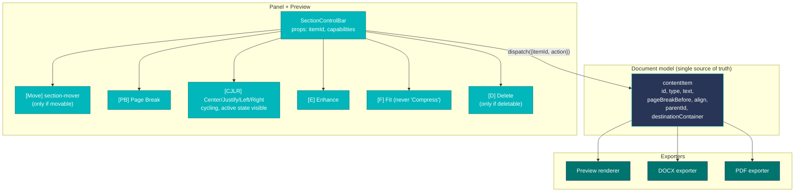

# AntCV — UI/UX Bug-fix Implementation and QA Plan

| | |
|---|---|
| Source spec | `AntCV_UI_UX_Spec_and_QA_Plan.docx` (combined functional spec + bug report + QA plan) |
| Scope | Cover Letter editor, page-break model, AI watermark, Candidate/Application, drag-and-drop, tables, Selected Outcomes, Publications |
| Output rule | Every change must behave identically in Preview, DOCX, and PDF unless the requirement explicitly excludes export |
| Authority | This document overrides the screenshots referenced in the source spec. Screenshots describe the current defective state, not the target state. |
| Acceptance gate | A requirement is done only when the Definition of Done block (§9) is filled in and all linked test cases pass in Preview **and** DOCX **and** PDF |

The spec contains 30 numbered requirements plus 10 visual findings. They cluster into seven implementation areas. Within each area the work is mostly downstream of one shared refactor: collapsing the duplicated per-section control toolbars into one component with a single action contract. Doing that refactor first turns most of the per-section fixes into small configuration changes; doing it last forces ten near-identical patches.

---

## 1. Priority and sequencing

Implement in this order. Each phase is a coherent commit/PR boundary.

| Phase | IDs | Why this phase |
|---|---|---|
| **P0-A — Shared control component** | GEN-001..GEN-008 | All other section-level fixes ride on this. Without it, the same defect is patched 7 times in 7 files. |
| **P0-B — Page-break model** | PB-001..PB-005 | Page breaks must live in the document model, not DOM state, because exporters consume the model. This is the second prerequisite. |
| **P0-C — Cover Letter editor** | CL-001..CL-005, VF-001..VF-003 | Highest-visibility defect set (duplicate overlay on every text selection). |
| **P0-D — Candidate, Application, drag-and-drop** | CA-001..CA-005, VF-005..VF-007 | Drag-and-drop corrupts placement and styling; blocks any further layout work. |
| **P1-A — AI watermark anchoring** | WM-001..WM-002, VF-004 | Final-output quality. Must be page-box-anchored, not flow-anchored. |
| **P1-B — Tables, Selected Outcomes, Publications** | TB-001..TB-003, SO-001..SO-002, PP-001..PP-002, VF-008..VF-010 | Extends the shared control model to row-based sections. Cheap once P0-A lands. |
| **P2** | Accessibility labels, keyboard focus order, fixture set | Polish after behavior is stable. |

---

## 2. Architectural diagram — shared control model



Two contracts derive from this:

1. **Action contract.** Every control event carries `{ itemId, action, payload? }`. Actions without `itemId` are rejected and logged. This is what enforces GEN-002 (control locality) — there is no path by which "click Page Break on row 3" can update row 4.
2. **Capabilities contract.** Each section declares what its items support: `{ canMove, canDelete, canPageBreak, canAlign, canEnhance, canFit }`. The `SectionControlBar` reads this and renders only the relevant buttons in the standard order (GEN-003).

---

## 3. Repo file map — where each fix lands

The PWA is the single `pwa/app.js` (804 KB) plus a stack of patch overlays loaded after it. Most defects live in the overlays. Touch the overlay, not `app.js`, unless the underlying model needs to change.

| Area | Primary file(s) to edit | Notes |
|---|---|---|
| Duplicate Preview action overlay (CL-001, VF-001) | `pwa/antcv-overlay.js` (66 KB) | Likely emits the "second" 8-button group on text selection. Hunt for the selection listener and remove the Preview-side overlay; panel-side controls remain authoritative. |
| Shared control bar component | New: `pwa/antcv-section-control-bar.js` | Centralises Page Break + CJLR + Enhance + Fit + Delete + Move into one React component with a capabilities prop. |
| How I Would Contribute bullets (CL-003, VF-002) | `pwa/antcv-how-contribute-controls-245.js`, `pwa/antcv-bullet-targets.js` | Currently has one shared 8-button row instead of per-bullet rows. Rewire to one `SectionControlBar` per bullet. |
| Foundation textbox split (CL-004, VF-003) | Search `app.js` for `Foundation` section renderer; add overlay if needed | Each textbox gets its own 4-button bar. |
| Cover letter body section move buttons (CL-005, CA-003, VF-006) | `pwa/antcv-section-panel-211.js`, `pwa/antcv-section-main-panel-fix.js` | The move button exists on Candidate items but is missing on body rows. Same component should be reused. |
| Page-break model (PB-001..PB-005) | `pwa/antcv-page-breaks-everywhere-284.js`, `pwa/antcv-sidebar-subsection-pagebreaks-329.js`, `pwa/antcv-item-pages-render.js`, `pwa/antcv-page-button-polish-327.js`, `pwa/antcv-table-page-splits-327.js` | Page-break state must be persisted in the document model and read by Preview, DOCX, and PDF. Replace the down-arrow icon and remove "compress" wording. |
| Table page-break + CJLR (TB-001..TB-003, VF-008) | `pwa/antcv-core-competencies-row-controls-234.js`, `pwa/antcv-what-i-bring-row-controls-327.js`, `pwa/antcv-table-page-splits-327.js`, `pwa/antcv-table-row-page-controls-328.js` | Per-line CJLR + per-row Page Break. Update help text — no "compress" string left visible. |
| Selected Outcomes (SO-001, SO-002, VF-009) | `pwa/antcv-selected-outcomes-row-controls-237.js` | Add Page Break / CJLR / Enhance / Fit before the existing Delete in each row. |
| Publications row layout (PP-001, PP-002, VF-010) | `pwa/antcv-publications-strict-row-layout-273.js`, `pwa/antcv-publications-section-panel-row-fix-278.js` | All controls must remain visible at narrow editor widths; wrap to a second line rather than clip. |
| AI watermark (WM-001, WM-002, VF-004) | Likely `pwa/antcv-overlay.js` (Preview), `pwa/antcv-docx-client.js` (DOCX), `pwa/antcv-pdf-page-mismatch.js` + PDF render path | Anchor to page box, not text flow. Last page only. Pick lower-left vs lower-right by content distance. |
| Candidate/Application sentence (CA-001, CA-002, VF-005) | `pwa/antcv-personality.js` or wherever Candidate items render; `pwa/antcv-i18n.js` for the "Application:" label | Panel fields (Role, Company) and Preview sentence ("Application: Role - Company") must stay synchronised. |
| Drag-and-drop placement (CA-004, CA-005, VF-007) | `pwa/antcv-table-fast-drag.js`, `pwa/antcv-section-bar-freeze-fix.js`, `pwa/antcv-splitter-flip.js` | Insertion-point semantics, not append-to-end. Re-render moved item with destination style tokens. |
| Banned-wording sweep (GEN-004, PB-005) | `pwa/antcv-banned-audit.js`, `pwa/antcv-i18n.js` | Add "Compress" / "compress" to the audit's banned-string list. Update DA + EN i18n keys. |
| Continuation heading 18 pt offset (PB-003) | DOCX exporter (`pwa/antcv-docx-client.js`), PDF exporter, Preview CSS | The 18 pt is from the top edge of the page, not from the previous block. Must be the same in all three outputs. |

If a file above isn't where the defect actually lives, the recovery move is `github_search_code` on a distinctive string (e.g. `Compress` or `down-arrow` SVG path data) and follow the hits.

---

## 4. Detailed implementation — area by area

Each block below states **what to change**, **acceptance criteria** (lifted from the source spec), and the **regression hazard** to retest.

### 4.1 GEN — global requirements (P0-A)

| ID | What to change | Acceptance | Regression hazard |
|---|---|---|---|
| GEN-001 | Make Preview/DOCX/PDF all consume the same model. No DOM-only state. | Same text, order, page-break behaviour, styling, watermark in all three. | Any place that reads from a React ref instead of the model. |
| GEN-002 | Every control event carries `itemId`. Reject events without one. | Clicking PB/CJLR/Enhance/Fit/Delete on row N never mutates row N±1. | Bulk operations must explicitly iterate IDs; no "active section" implicit target. |
| GEN-003 | Standard order: `[Move] PB CJLR Enhance Fit [Delete]`. Move only if movable, Delete only if deletable. | Every editor renders controls in this order. | Custom one-off orders in older overlays. |
| GEN-004 | Remove all user-facing "Compress" wording: visible text, tooltips, aria-labels, help text. | Banned-audit shows zero hits for "compress". | i18n DA + EN keys + any hardcoded strings. |
| GEN-005 | Preview-edited text persists after blur, reopen, and DOCX/PDF export. | Edit → blur → reopen → export round-trip is lossless. | Sections that read from DOM textContent at export time. |
| GEN-006 | No clipped controls. Wrap to a second control line if the row is narrow. | All required buttons visible without horizontal scroll at supported viewports. | Publications row, table rows at narrow editor width. |
| GEN-007 | Drag result == panel-control result. | Same final model after either path. | Style classes that travel with the dragged DOM node. |
| GEN-008 | Every icon button has a deterministic tooltip + aria-label naming action + target. | Example: `Page break for Selected outcome 2`. | i18n template keys, not concatenated strings. |

### 4.2 PB — Page-break behaviour (P0-B)

| ID | What to change | Acceptance |
|---|---|---|
| PB-001 | PB available from main and sidebar items. Button state visible. Updates page model, page number, Preview, DOCX, PDF. | All three outputs show the same split; numbering updates; active state shows. |
| PB-002 | First sub-subsection rule: PB on first sub-subsection moves the whole parent subsection to next page with the original heading (no duplication). | Whole subsection starts on next page; heading present once; internal order preserved. |
| PB-003 | Continuation heading rule: PB on later sub-subsection — earlier content stays on current page; next page repeats the subsection heading with localised "Cont." suffix at 18 pt from top of page. | Continuation heading appears at 18 pt; localised in active language; original content order preserved. |
| PB-004 | Table rules: PB from first row/cell moves whole table; PB from later row splits table at that row and **repeats table header** on the new page. | Whole-move vs split behaviour matches; headers repeat; no row loss or reorder. |
| PB-005 | Replace the down-arrow icon with a semantic page-change icon. Remove "compress" from all surrounding help text and tooltips. | No PB control uses a down arrow; no user-facing "Compress" remains. |

**Implementation note.** The Page-break flag belongs on the item, not on the control: `item.pageBreakBefore = true`. The rule logic (PB-002 / PB-003 / PB-004) is then a pure function of `(items, index)` consumed identically by Preview and exporters. Avoid encoding the rule inside the exporters — it duplicates and drifts.

### 4.3 CL — Cover Letter editor (P0-C)

| ID | What to change | Acceptance |
|---|---|---|
| CL-001 | Remove the duplicate 8-button overlay that appears when text is selected in Preview. Keep direct editing + focus state. | Selecting Greeting/Opening/Who I Am/What I Bring/Why This Position/How/Foundation/Closure shows editable focus only — no duplicate button array. |
| CL-002 | Closure becomes directly editable in Preview, persists across blur/reopen/export. | Round-trip lossless in Preview, panel, DOCX, PDF. |
| CL-003 | How I Would Contribute: model as `{intro, bullets[], closing}`. Each bullet is its own item with its own SectionControlBar. Intro + closing get their own bars too. Add `+ Add` under the last bullet. | Each bullet independently controllable. Closing stays a paragraph, never becomes a bullet. `+ Add` appends a bullet at the end. Delete removes only the selected bullet. |
| CL-004 | Foundation: attach one 4-button bar (PB, CJLR, Enhance, Fit) to each textbox (Hands-on, Professionally). Bars do not float between textboxes. | Changing the first textbox does not affect the second; and vice versa. Exports match Preview. |
| CL-005 | Cover letter body rows get the section-move button to the left of the action cluster. Existing on/off visibility stays as an independent control. Standard order applies to the rest. | Move button visible on every movable body row. Toggling visibility doesn't corrupt content. Required controls remain visible. |

### 4.4 CA — Candidate, Application, section movement (P0-D)

| ID | What to change | Acceptance |
|---|---|---|
| CA-001 | All Candidate items editable directly in Preview, persisted to panel model and exports. | Edits to Name, Application sentence, contact-like fields survive blur, reopen, export. |
| CA-002 | Application model: panel exposes `applicationLabel` (default "Application") + `role` + `company`. Preview renders `${applicationLabel}: ${role} - ${company}` and is editable in place. Edits to the rendered sentence parse back into the three fields. | Panel and Preview stay synchronised. No duplicate label. Exports match Preview. |
| CA-003 | Section move button on every movable item: Candidate, cover letter body, CV sidebar, CV main. Placed left of the action cluster. Tooltip and aria-label name the allowed destinations. | Move button visible and usable on every movable item, consistently placed. |
| CA-004 | Drag-and-drop uses **insertion-point** semantics: drop preview shows the target index; drop inserts exactly at that index. Works in main and sidebar. | Drag to first/middle/last positions in main and sidebar lands at the indicator, not the end. |
| CA-005 | Moving items between containers preserves the data but re-renders with destination-container style tokens (text colour, icon colour, background, spacing, heading). Restore returns the item to its previous container and order. | Moved Contact (top→main, main→sidebar, sidebar→top) is readable, uses destination styling, keeps order. Restore round-trips. |

### 4.5 WM — AI watermark (P1-A)

| ID | What to change | Acceptance |
|---|---|---|
| WM-001 | Watermark is a page-level object anchored to the last page only. Never part of body flow. Does not move when content reflows. | One-page, two-page, three-page docs all show the watermark only on the last page lower corner in Preview, DOCX, PDF. |
| WM-002 | Choose lower-left vs lower-right by available visual distance from main content. Keep visible on coloured backgrounds. Never overlap text. | Watermark is visible, does not overlap body, picks the lower corner with better separation. |

**Implementation note.** In DOCX this is a header/footer or a floating shape anchored to the page, not an in-flow paragraph. In PDF it's drawn after the last-page content pass. In the React Preview it's a positioned element inside the last page's page-box, not inside the content flow.

### 4.6 TB / SO / PP — tables, outcomes, publications (P1-B)

| ID | What to change | Acceptance |
|---|---|---|
| TB-001 | CJLR per editable line in Core Competencies (each row cell where applicable). | Each line keeps its own alignment; no sibling line changes. |
| TB-002 | Per-row Page Break in Core Competencies and What I Bring, using PB-004 split rules. | Move-whole-table vs split-with-repeated-headers matches the rule. |
| TB-003 | Update visible help text: describe the actual controls (hide where supported, Fit, Enhance, CJLR, Page Break). No "compress" wording. | Help text matches controls. Standard order used. |
| SO-001 | Each Selected Outcome row exposes `PB CJLR Enhance Fit Delete` from left to right. Up/down reorder stays on the far left. | Every row has the required controls; each acts on its own row; prefix stays bold, result stays normal. |
| SO-002 | `+ Outcome` adds a new row with editable bold prefix + result text + reorder + standard control group + delete. | New rows behave identically to existing rows; appear in the same order in all outputs. |
| PP-001 | Publications row layout exposes `PB CJLR Enhance Fit Delete` all visible at supported viewports. Wrap to a secondary line if needed; do not clip. | All controls clickable for every publication row at supported viewport widths. |
| PP-002 | Keep the single publication input. All row controls act on the whole entry; Delete removes only that entry. | No unrelated publication changes; exports match Preview. |

---

## 5. Implementation guidance

These follow directly from the source spec §7 plus what's visible in the repo layout.

- **Start with the shared component and the action contract.** The repeated defects across `antcv-*-row-controls-*.js` files are the same defect duplicated. Centralise.
- **Every control event carries `itemId`.** Reject events without one. This is what enforces GEN-002 mechanically rather than by convention.
- **Store manual page breaks in the document model**, not in DOM state. Preview, DOCX, and PDF must all read the same flag.
- **Use destination-container style tokens** when rendering moved items. Don't carry source CSS classes through a move.
- **Build fixtures before refactoring exporters.** See §8 for the fixture set.
- **Old saved CVs and cover letters must still load.** Migrate missing per-row control state to defaults; don't crash on schema drift.
- **Add stable test IDs to repeated controls**: `data-testid="{itemType}.{itemId}.{action}"`. This is what makes automated test selectors not brittle.
- **Treat any Preview ↔ DOCX ↔ PDF mismatch as a failed implementation, not an export-only issue.**

### Local hazards specific to this repo

These come from AntCV's existing constraints. Carry them through every edit:

- **No `\s` in regex literals.** The test harness brace-counter misreads `\` inside regex. Use loop-based char-comparison helpers.
- **No `\u` Unicode escapes in JSX text positions.**
- **Comment stripper only strips standalone `//` lines.** Do not strip patterns inside strings or regex.
- **LinkedIn must never be dropped from contact items.**
- **OOXML strict validator must show zero errors and zero warnings** after the DOCX exporter changes.
- **`w:rFonts` ordering** in `rPr` arrays must come first (before `w:b`, `w:sz`). Word rejects otherwise.
- **All `w:w` attribute values cast through `Math.round()`** — Word rejects decimal twip values.

---

## 6. QA strategy

Adapted from the source spec §8. The tester verifies from both the user perspective and the export perspective. A panel-only pass is not a pass.

| Test layer | Tester action | Pass condition |
|---|---|---|
| Component | Trigger each control against a mocked content item id. | Only the target item changes; state updates are deterministic. |
| Panel UI | Inspect every affected row and textbox at normal **and** narrow widths. | Controls visible, ordered, scoped, labelled. |
| Preview editing | Edit text, click away, reopen item, refresh Preview where supported. | Edited text persists; remains editable. |
| Export parity | Export DOCX and PDF after each class of change. | DOCX and PDF match Preview for order, page break, style, watermark placement. |
| Regression | Repeat tests in adjacent sections that share controls. | A fix in one section does not break another. |

---

## 7. Minimum test cases

From the source spec §9. These are the gating cases — every commit in P0/P1 must keep these green.

| ID | Area | Steps | Expected result |
|---|---|---|---|
| TC-001 | Global controls | Open every affected editor; inspect controls on rows, textboxes, bullets. | Required controls visible and ordered; Delete only where supported. |
| TC-002 | Control locality | Apply CJLR and Fit to one row in each affected section. | Only the selected row/textbox changes; siblings unchanged. |
| TC-003 | Deprecated wording | Search UI, tooltips, help text, aria-labels for "Compress". | Zero hits. All relevant text says "Fit". |
| TC-004 | Cover Letter Preview | Select text in all cover letter sections. | No redundant 8-button overlay in Preview; editing still works where supported. |
| TC-005 | Closure editing | Edit Closure in Preview → blur → reopen → export. | Edited text persists in Preview, panel, DOCX, PDF. |
| TC-006 | How I Would Contribute | Add, delete, align, enhance, fit, page-break individual bullets. | Each bullet independently controlled; closing line stays a paragraph. |
| TC-007 | Foundation control split | Apply different CJLR states to Foundation textboxes. | Each textbox keeps its own state; export matches Preview. |
| TC-008 | PB first item | Trigger PB on first sub-subsection in main and sidebar. | Entire subsection moves to next page with original heading. |
| TC-009 | PB continuation | Trigger PB on later sub-subsection. | Continuation heading with localised label at 18 pt from page top. |
| TC-010 | Table split | Trigger PB from first and later rows in What I Bring and Core Competencies. | Whole table moves from first row; later row splits table and repeats headers. |
| TC-011 | Watermark 1-page | One-page CV + cover letter with watermark on. | Lower corner of the single page; no text overlap. |
| TC-012 | Watermark multi-page | Multi-page CV + cover letter. | Only on last-page lower corner in Preview, DOCX, PDF. |
| TC-013 | Application sentence | Edit panel role/company; then edit Preview sentence. | Panel and Preview synchronised; no duplicate label. |
| TC-014 | Section move buttons | Inspect Candidate, cover letter body, CV sidebar, CV main. | Move button left of action buttons on every movable item. |
| TC-015 | Drag-and-drop placement | Drag to first/middle/last in main and sidebar. | Item lands exactly at the indicator. |
| TC-016 | Destination styling | Move Contact across containers; use Restore. | Readable, destination-styled, order preserved; Restore round-trips. |
| TC-017 | Core Competencies CJLR | Set different alignments on separate rows. | Only the selected row/line changes; export matches Preview. |
| TC-018 | Selected Outcomes controls | Apply every row action to one outcome. | Only that outcome changes; prefix/result formatting preserved. |
| TC-019 | Publications at narrow width | Long publication row + narrow viewport. | PB, CJLR, Enhance, Fit, Delete all visible and usable. |
| TC-020 | Regression sweep | Repeat smoke tests on every section using PB, CJLR, Enhance, Fit, Delete, Move. | No shared-control regressions. |

---

## 8. Fixture set

Build before refactoring exporters. Each fixture is a saved CV/cover letter JSON the tester reuses.

| Fixture | Purpose |
|---|---|
| `CL-short` | One-page cover letter with all body sections visible. |
| `CL-long` | Multi-page cover letter, long Foundation + How I Would Contribute. |
| `CV-main-sidebar` | CV with top bar, main, sidebar, Candidate, Contact, Core Competencies, Selected Outcomes, Publications. |
| `Table-long` | What I Bring + Core Competencies with enough rows to force a split. |
| `Colored-layout` | Coloured header + coloured sidebar + dense final page — watermark contrast and collision. |
| `Narrow-editor` | Editor viewport narrow enough to stress row controls. |
| `Localized-continuation` | DA + EN active language to verify continuation labels. |

---

## 9. Definition of Done — per-requirement report template

A requirement is accepted only when this block is filled. Copy-paste per ID into the PR description.

```
Requirement ID:        e.g. PB-004
Implemented behaviour: <what changed: model, UI, Preview, exporters>
Tests performed:       <automated + manual, fixture names, steps>
Observed result:       <what the tester saw in Preview, DOCX, PDF — include failures, not only passes>
Pass / fail:           Pass only if observed == required
Regression notes:      <sections retested because they share the same control family>
```

### Acceptance gate summary (from spec §12)

- Not accepted on code-written alone.
- Not accepted if it works in Preview but not in DOCX or PDF (unless the requirement explicitly excludes export).
- Not accepted if the correct button exists but acts on the wrong item.
- Not accepted if drag-and-drop lands at the end when the indicator showed another position.
- Not accepted if the watermark is attached to text flow instead of the page box.
- Not accepted if any control is hidden, clipped, or requires horizontal scrolling.

---

## 10. Branch and commit plan

Suggested branches, one per phase. Each merges to `main` only after the linked test cases pass.

| Branch | Phase | Linked IDs | Linked TCs |
|---|---|---|---|
| `fix/shared-control-bar` | P0-A | GEN-001..GEN-008 | TC-001, TC-002, TC-003 |
| `fix/page-break-model` | P0-B | PB-001..PB-005 | TC-008, TC-009, TC-010 |
| `fix/cover-letter-editor` | P0-C | CL-001..CL-005, VF-001..VF-003 | TC-004, TC-005, TC-006, TC-007 |
| `fix/candidate-application-dnd` | P0-D | CA-001..CA-005, VF-005..VF-007 | TC-013, TC-014, TC-015, TC-016 |
| `fix/watermark-page-anchor` | P1-A | WM-001, WM-002, VF-004 | TC-011, TC-012 |
| `fix/tables-outcomes-publications` | P1-B | TB-001..TB-003, SO-001..SO-002, PP-001..PP-002, VF-008..VF-010 | TC-017, TC-018, TC-019 |
| `fix/regression-sweep` | gate | — | TC-020 |

---

## 11. Open questions for the product owner

These are decisions that affect implementation but the source spec leaves under-specified.

1. **Application sentence editability — parser strictness.** When the user edits the rendered Preview sentence directly (CA-002), do we hard-parse it back into `{role, company}` on every keystroke, or only on blur? Hard-parse on every keystroke is brittle when the user is mid-typing the `-` separator.
2. **Fit limits.** The spec defines Fit as "reduce or rebalance within defined limits, but must not change content meaning". The limits themselves are not enumerated. Without them, the tester cannot deterministically verify Fit behaviour.
3. **Watermark contrast threshold.** WM-002 says "lowest reasonable visual attention" and "visible on supported backgrounds". A measurable contrast floor (e.g. WCAG AA on the chosen corner background) would make this testable.
4. **Continuation label localisation.** PB-003 requires localised continuation suffix. DA + EN are confirmed. ES + Mandarin are on the roadmap — does this phase need them, or only DA + EN?
5. **Section move destinations per section type.** CA-003 says "every movable item gets a move button". The exact destination matrix (which item types may move to which containers) is not in the spec and should be confirmed before the tooltip/aria-label text is finalised.

---

## 12. Source of truth

`AntCV_UI_UX_Spec_and_QA_Plan.docx`. This implementation plan paraphrases and rearranges it for execution; the source spec wins on any conflict.
